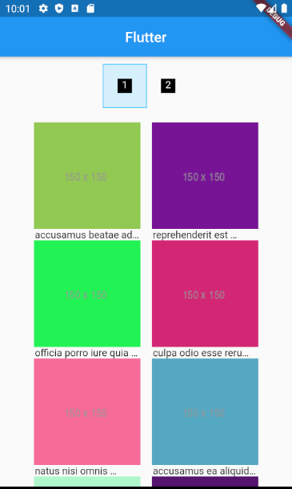
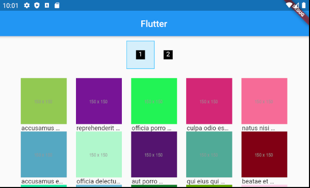

# take_home_assignment

Flutter assessment by Carsome.

### Prerequisites
1. Flutter
2. Android Studio / XCode - For emulator / simulator
3. IDE - Android Studio, IntellliJ IDEA, VSCode.

### Running
1. `flutter run` on terminal or IDE configuration setup.

## Running the tests
1. `flutter test --coverage` - This will generate [LCOV](http://ltp.sourceforge.net/coverage/lcov.php)

## Formatter
1. Run `dartfmt -w lib/ test/`

## Build with.
1. Architecture
    1. [Flutter_bloc](https://pub.dev/packages/flutter_bloc) - State Management
    2. [Flutter_hooks](https://pub.dev/packages/flutter_hooks) - Widget Lifecycle
    3. [Equatable](https://pub.dev/packages/equatable) - Object equalities
    
2. Services
    1. [Dio](https://pub.dev/packages/dio) - Network
    2. [Retrofit](https://pub.dev/packages/retrofit) - Network Interface

## Screenshots





## Development environment
```
[✓] Flutter (Channel stable, v1.17.0, on Linux, locale en_US.UTF-8)
    • Flutter version 1.17.0 at /home/yuzuriha/devenv/flutter
    • Framework revision e6b34c2b5c (2 weeks ago), 2020-05-02 11:39:18 -0700
    • Engine revision 540786dd51
    • Dart version 2.8.1

 
[✓] Android toolchain - develop for Android devices (Android SDK version 29.0.3)
    • Android SDK at /home/yuzuriha/Android/Sdk
    • Platform android-29, build-tools 29.0.3
    • Java binary at: /home/yuzuriha/.local/share/JetBrains/Toolbox/apps/AndroidStudio/ch-0/192.6392135/jre/bin/java
    • Java version OpenJDK Runtime Environment (build 1.8.0_212-release-1586-b4-5784211)
    • All Android licenses accepted.

[!] Android Studio (version 3.6)
    • Android Studio at /home/yuzuriha/.local/share/JetBrains/Toolbox/apps/AndroidStudio/ch-0/192.6392135
    ✗ Flutter plugin not installed; this adds Flutter specific functionality.
    ✗ Dart plugin not installed; this adds Dart specific functionality.
    • Java version OpenJDK Runtime Environment (build 1.8.0_212-release-1586-b4-5784211)

[✓] Connected device (1 available)
    • sdk gphone x86 • emulator-5554 • android-x86 • Android 10 (API 29) (emulator)

! Doctor found issues in 1 category.

```

## Authors

* [**Yusuf Rosman**](https://github.com/zaralockheart)

## License

This project is licensed under the MIT License - see the [LICENSE.md](LICENSE.md) file for details


